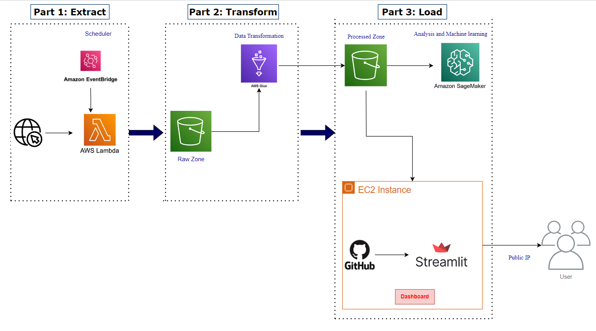

# EcomPulse Dashboard

EcomPulse Dashboard is an interactive application designed to visualize and analyze eCommerce data. The dashboard provides insights into vendor performance, sales distribution, stock status, and cluster analysis.

<p align="center">
    <br />
    <a href="figs/Demo.gif">View Demo</a>
</p>


<!-- TABLE OF CONTENTS -->
<details>
  <summary>Table of Contents</summary>
  <ol>
    <li>
      <a href="#Features">Features</a>
    </li>
    <li>
      <a href="#Installation">Installation</a>
    </li>
    <li><a href="#Data">Data</a></li>
    <li>
       <a href="#Components">Components</a>
       <ul>
        <li><a href="#Architecture">Architecture</a></li>
        <li><a href="#ETL pipeline">ETL Process</a></li>
      </ul> 
    </li>
    <li><a href="#app.py">app.py</a></li>
    <li><a href="#Usage">Usage</a></li>
    <li><a href="#License">License</a></li>
  </ol>
</details>


## Features

- **Home Page**: Summary of key performance indicators with various interactive charts.
- **Graphs Page**: Detailed view of individual charts and their findings.
- **Architecture & Data Page**: Project architecture diagram and dataframes.


## Installation

Follow these steps to install and run the EcomPulse dashboard on an AWS EC2 instance.


1. **Login with your AWS console and launch an EC2 instance and then connect**

2. **Run the following commands to set up the environment**
 (Note: Port should be:- 8501)

**Update the package lists**
```bash
sudo apt update
```
```bash
sudo apt-get update
```
**Upgrade the installed packages**
```bash
sudo apt upgrade -y
```
**Install necessary packages**
```bash
sudo apt install git curl unzip tar make sudo vim wget -y
```

**Clone the EcomPulse repository**

```bash
git clone "https://github.com/SinghAbhishek07/EcomPulse.git"
```
**Navigate to the EcomPulse directory**
 ```bash
    cd ~/EcomPulse  
```

**Install Python 3 and virtual environment**
```bash
    sudo apt install python3 python3-venv -y
```
**Create a virtual environment**
 ```bash
    python3 -m venv venv
```

**Activate the virtual environment**
```bash
    source venv/bin/activate
```

**Install the required Python packages**

```bash
pip install -r requirements.txt
```
**Run the Streamlit app temporary**
```bash
#Temporary running
streamlit run app.py
```
**For Permanent running**
```bash
nohup python3 -m streamlit run app.py
```


## Data

The data is stored in Amazon S3 bucket  and is fetched dynamically by the application.
- URL for [product_data](https://temus-northstar.github.io/data_engineering_case_study_public/product_data.html)
- URL for [vendor_data](https://temus-northstar.github.io/data_engineering_case_study_public/vendor_data.html)

## Components

### Architecture



### ETL Pipeline

The ETL pipeline involves the following steps:
1. **Extract Phase (Part 1):**

- **Scheduler (Amazon CloudWatch):** Manages the scheduled execution of AWS Lambda functions.
- **AWS Lambda:** Fetches data from the web dynamically.

2. **Transform Phase (Part 2):**

- **Raw Zone (Amazon S3):** Stores the raw data fetched by AWS Lambda.
- **AWS Glue:** Performs data transformation on the raw data.
- **Processed Zone (Amazon S3):** Stores the transformed data.

3. **Load Phase (Part 3):**

- **Amazon SageMaker:** Uses the processed data for analysis and machine learning.
- **EC2 Instance:** Hosts the Streamlit application.
- **GitHub:** Stores the code for the Streamlit dashboard.
- **Streamlit:** Provides the real-time dashboard for data visualization.
- **Public IP:** Allows users to access the dashboard via a public IP address.

## app.py

The `app.py` file is designed to perform the following tasks:

- **Set up the Streamlit application layout and sidebar navigation:** This involves creating an intuitive and user-friendly interface for the dashboard, ensuring easy navigation through different sections of the application.

- **Fetch and preprocess data from Amazon S3:** The application retrieves processed data stored in Amazon S3, then performs necessary steps such as transforming the data to make it suitable for visualization and analysis.

- **Define functions to create various Plotly charts for visualization:** This file contains functions that generate interactive charts using Plotly. These charts provide insights into vendor performance, sales distribution, stock status, and cluster analysis.

- **Organize the application into different pages:** The application is divided into multiple pages to display the visualizations and data tables. These pages include:
  - **Home:** Summary of key metrics and charts.
  - **Graphs:** Detailed individual charts and their observations and findings.
  - **Architecture & Data:** Project architecture diagram and  every dataframes.


## Usage

Navigate through the sidebar to explore the different pages of the EcomPulse dashboard. Each page is designed to provide specific insights and functionalities:

- **Home**: This page provides an overview of the dashboard's key metrics and interactive charts. It summarizes essential performance indicators, giving you a quick snapshot of the eCommerce data.

- **Graphs**: On this page, you can select and view detailed individual charts. These charts offer in-depth analysis and visualization of various data aspects, such as vendor performance, sales distribution, and stock status. Each graph is interactive, allowing you to hover over data points for more information.

- **Architecture & Data**: This page presents the project architecture diagram and data tables. It gives you a comprehensive view of the data pipeline, showing how data flows from extraction to transformation and loading. Additionally, you can explore the data tables used in the dashboard, providing transparency and insight into the underlying data structures.


## License


This project is developed and maintained by "ABHISHEK SINGH". All rights reserved.
